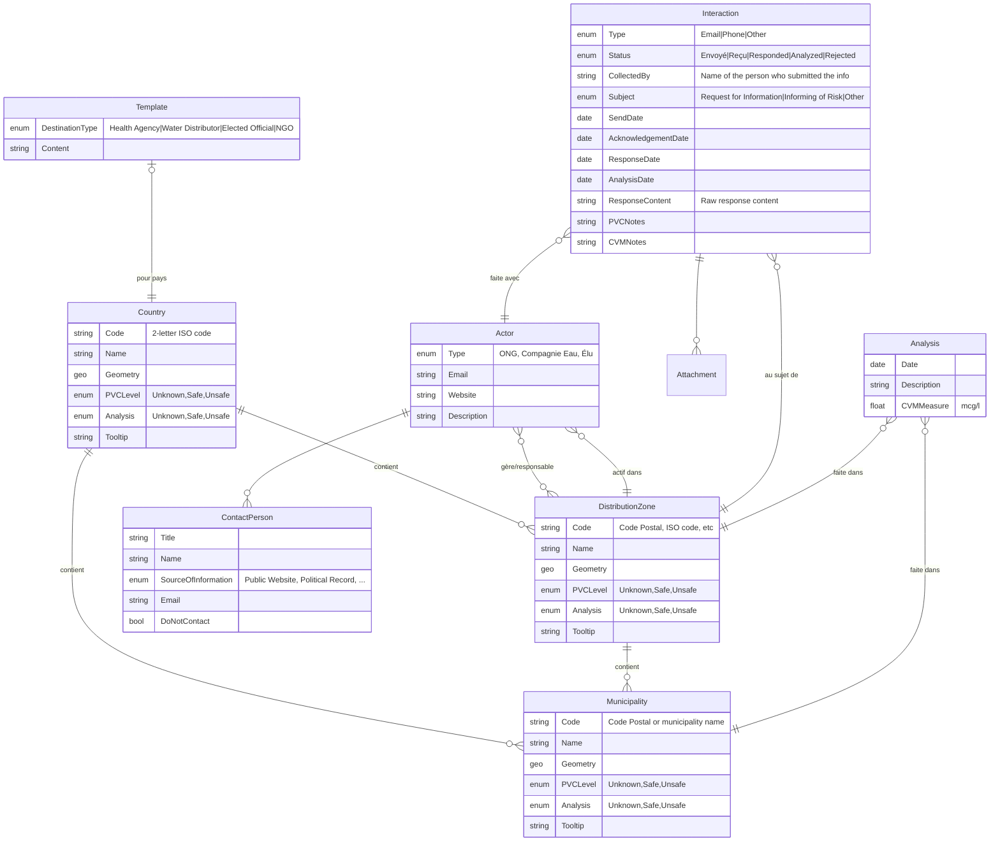

## Construction

We work with:

- **Geographic areas** (countries, municipalities, etc.)
- **Actors** (distribution companies, NGOs, etc.)
- **Interactions** carried out with these actors concerning the areas

### Areas to display on the map

- Country  
- Region (not displayed on the map, but used to categorize health agencies)  
- Distribution Zone  
- Municipality (not directly displayed on the map, but used to calculate the surface of a distribution zone)

### Analysis level

Analyses are performed at the **municipality** level.

### Interactions

Interactions are carried out with respect to a **municipality**, a **country**, or a **distribution zone**.

### Templates

Templates are **country-specific**.

### Actors covering multiple distribution zones

Some actors cover multiple distribution zones:

- A water distribution company may have divided management zones (UGEs)
- A health agency operates at the regional or national level
- An elected official or an NGO may operate at the municipality, regional, or country level  
  (potentially with multiple zones, and multiple entities per zone)

### Importance of the municipality level

The **municipality** level is important because it is the most granular one; this is where we find the most specific information for the user.

## Diagram

